# Fama-French Portfolio Analysis: Return Modeling, Factor Exposure, and Strategy Backtesting

This project analyses nearly 100 years of monthly returns across six Fama-French portfolios sorted by size (small/large cap) and book-to-market ratio (growth/blend/value). The goals are to model the distributional and time-series properties of each portfolio, test whether lagged macroeconomic and factor variables have predictive power, explore cointegration and statistical arbitrage between portfolios, and compare the out-of-sample performance of several mean-variance portfolio strategies.

The entire econometric pipeline is implemented from scratch in pure NumPy and Pandas — no scipy or statsmodels. Every routine (ARMA fitting, GARCH, ADF tests, Ljung-Box, Engle-Granger cointegration, Ledoit-Wolf shrinkage, and the Markowitz frontier) is written out explicitly and is readable in the code.

## Repository Structure

```
├── run_analysis.py    # Driver: runs the full pipeline, writes all figures and tables
├── econ_lib.py        # Econometrics library (ARMA, GARCH, VAR, cointegration, MV optimisation)
├── load_data.py       # Data loading and Fama-French factor proxy construction
├── Data.csv           # Kenneth French 6-portfolio monthly returns (July 1926 to January 2026)
├── figures/           # Output: all plots as PDF and PNG
└── tables/            # Output: all numeric results as JSON and CSV
```

## The Data

The dataset is Kenneth French's six portfolios formed by the intersection of two size groups (small, big) and three book-to-market groups (low BM = growth, mid, high BM = value), covering July 1926 to January 2026 (1,195 monthly observations). Each observation is a monthly return in percent.

```
SMALL.LoBM   small-cap growth
ME1.BM2      small-cap blend
SMALL.HiBM   small-cap value
BIG.LoBM     large-cap growth
ME2.BM2      large-cap blend
BIG.HiBM     large-cap value
```

Because the Fama-French factor data is not loaded from an external source, factor proxies are constructed internally from the six portfolios. To avoid contaminating predictive regressions, all factor variables used as predictors are built via a leave-one-out scheme: the target portfolio is excluded when computing the market, SMB, and HML proxies.

## Analysis Pipeline

### 1. Descriptive Statistics

For each portfolio: mean, standard deviation, skewness, excess kurtosis, Jarque-Bera normality test, Ljung-Box test on returns and squared returns, Engle's ARCH-LM test, and the ADF stationarity test.

**Table 1: Summary statistics (monthly returns, %)**

| Portfolio | Mean | Std Dev | Skewness | Excess Kurtosis | ADF Stat |
|---|---|---|---|---|---|
| SMALL.LoBM | 0.974 | 7.432 | 0.566 | 6.924 | −9.615 |
| ME1.BM2 | 1.236 | 6.942 | 1.105 | 13.406 | −9.724 |
| SMALL.HiBM | 1.420 | 8.080 | 1.960 | 20.855 | −9.368 |
| BIG.LoBM | 0.958 | 5.266 | −0.128 | 5.203 | −9.175 |
| ME2.BM2 | 0.962 | 5.602 | 1.160 | 17.201 | −9.223 |
| BIG.HiBM | 1.213 | 7.081 | 1.443 | 17.449 | −9.333 |

All six portfolios strongly reject the Jarque-Bera normality test (p ≈ 0). ADF statistics are all below −9, firmly rejecting the unit root at any conventional significance level. Small-cap portfolios have substantially higher volatility: SMALL.HiBM has the largest standard deviation (8.08%) and the most extreme kurtosis (20.9). Large-cap growth (BIG.LoBM) is the only portfolio with negative skewness. Squared returns show significant autocorrelation across all six portfolios (Ljung-Box at lag 12, p ≈ 0), and ARCH-LM tests confirm strong volatility clustering in every series.

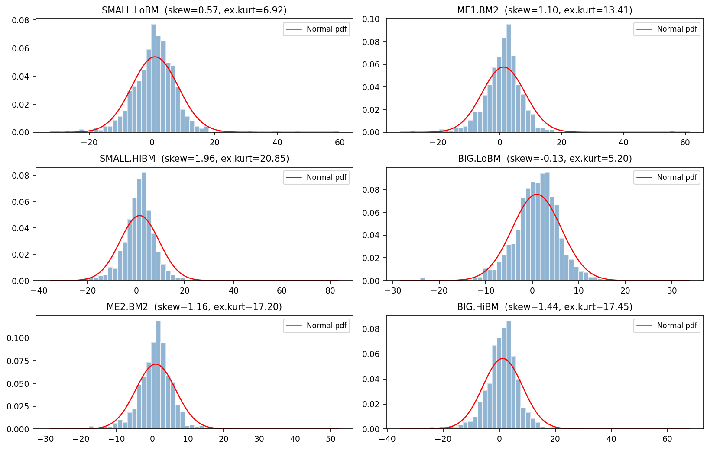

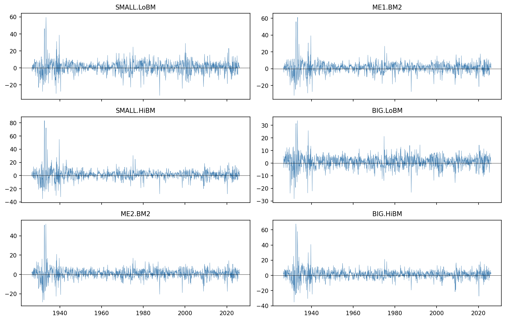

### 2. ARMA Model Selection

For each portfolio, ARMA(p,q) models with p, q ∈ {0, 1, 2} are estimated by minimising the Bayesian Information Criterion. A custom Nelder-Mead optimiser drives the conditional sum-of-squares likelihood. Residual diagnostics include ACF of residuals, ACF of squared residuals, and the ARCH-LM test.

**Table 2: BIC-selected ARMA models**

| Portfolio | Best Model | BIC |
|---|---|---|
| SMALL.LoBM | MA(2) | 8173.6 |
| ME1.BM2 | AR(1) | 8005.5 |
| SMALL.HiBM | ARMA(2,1) | 8359.8 |
| BIG.LoBM | MA(1) | 7369.3 |
| ME2.BM2 | ARMA(2,2) | 7492.1 |
| BIG.HiBM | ARMA(2,2) | 8062.1 |

Selected orders are low across the board, reflecting weak but detectable mean dynamics. After fitting, residual Ljung-Box tests confirm no remaining linear autocorrelation in any portfolio. However, Ljung-Box on squared residuals and ARCH-LM tests confirm that volatility clustering survives the ARMA filter in every case, motivating the GARCH step.

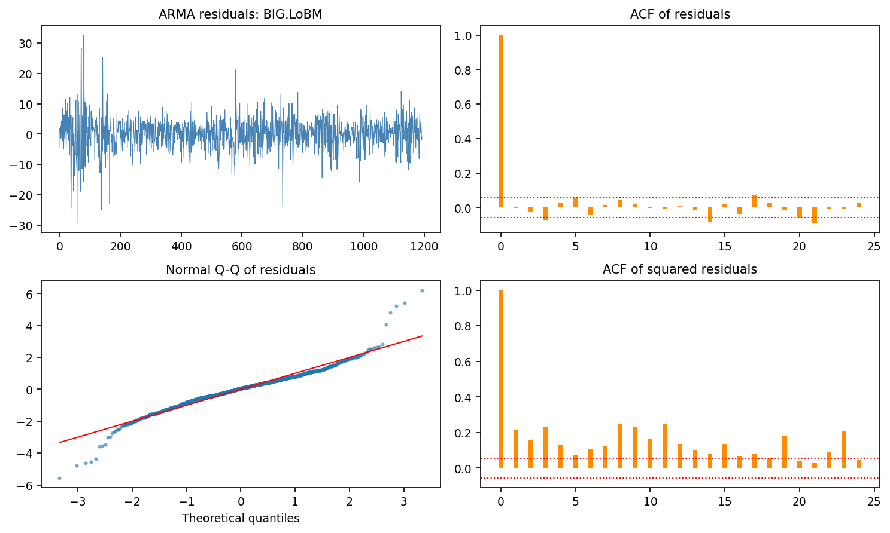

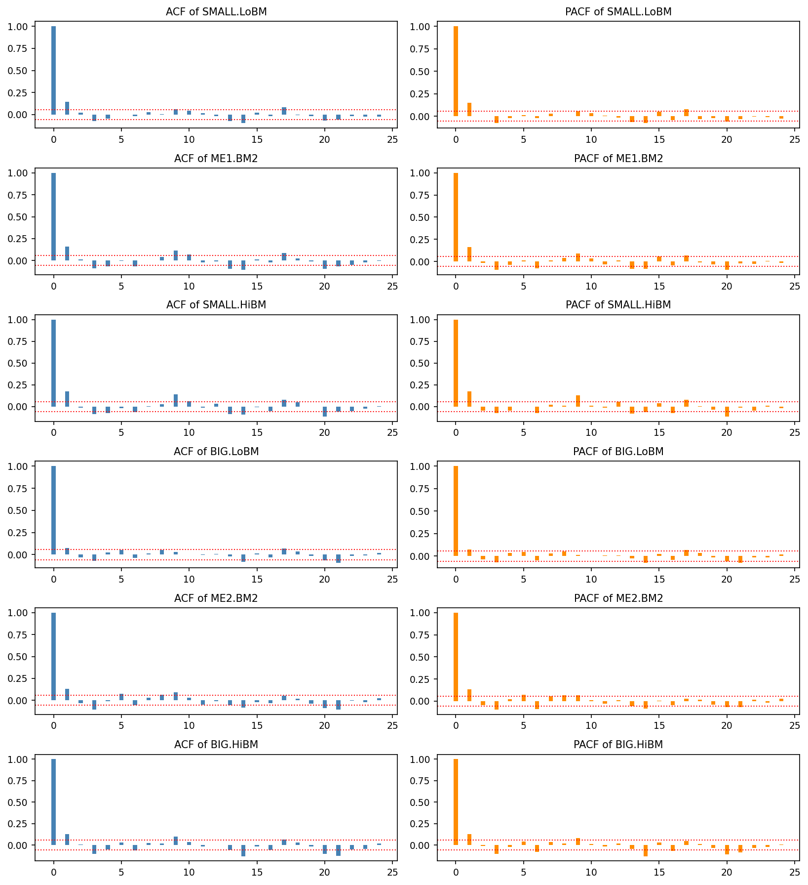

### 3. GARCH(1,1) on ARMA Residuals

A GARCH(1,1) model is fitted to the residuals of each portfolio's best ARMA model:

```
sigma_t^2 = omega + alpha * eps_{t-1}^2 + beta * sigma_{t-1}^2
```

**Table 3: GARCH(1,1) parameter estimates**

| Portfolio | ω | α | β | Persistence (α+β) |
|---|---|---|---|---|
| SMALL.LoBM | 1.447 | 0.136 | 0.843 | 0.980 |
| ME1.BM2 | 1.216 | 0.133 | 0.843 | 0.976 |
| SMALL.HiBM | 1.290 | 0.131 | 0.849 | 0.980 |
| BIG.LoBM | 0.691 | 0.131 | 0.849 | 0.980 |
| ME2.BM2 | 0.670 | 0.131 | 0.848 | 0.979 |
| BIG.HiBM | 1.263 | 0.136 | 0.833 | 0.969 |

Persistence (α + β) ranges from 0.969 to 0.980 across all portfolios, meaning volatility shocks are extremely slow to decay — a return shock today continues to affect conditional variance for many months. After GARCH filtering, the standardised residuals show no remaining ARCH effects in any portfolio (ARCH-LM p-values all above 0.5), confirming that the GARCH(1,1) fully captures the variance dynamics.

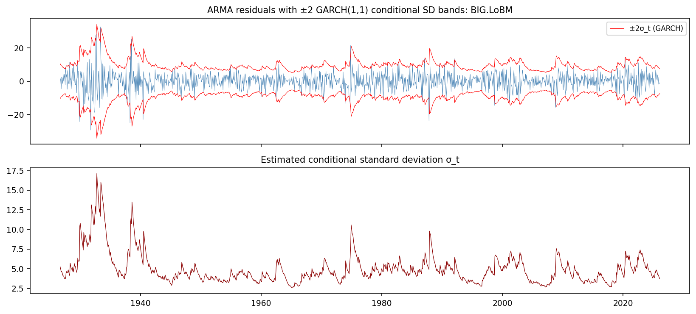

### 4. Factor Models and Predictive Regressions

Two separate regression exercises are run.

**Contemporaneous factor model.** Each portfolio is regressed on the leave-one-out market (Mkt-RF), SMB, and HML proxies simultaneously.

**Table 4: Factor model loadings (t-statistics in parentheses)**

| Portfolio | α | β_Mkt | β_SMB | β_HML | R² |
|---|---|---|---|---|---|
| SMALL.LoBM | −0.003 (−0.05) | 1.089 (88.5) | 0.955 (34.8) | −0.636 (−29.9) | 0.918 |
| ME1.BM2 | 0.401 (11.2) | 0.953 (135.2) | 0.407 (33.4) | 0.015 (1.4) | 0.969 |
| SMALL.HiBM | 0.444 (8.0) | 1.019 (92.4) | 0.730 (31.4) | 0.602 (32.5) | 0.945 |
| BIG.LoBM | 0.521 (9.0) | 0.842 (82.7) | −0.723 (−26.9) | −0.582 (−28.2) | 0.861 |
| ME2.BM2 | 0.235 (5.0) | 0.889 (101.6) | −0.509 (−29.1) | 0.075 (5.3) | 0.918 |
| BIG.HiBM | 0.396 (5.4) | 0.931 (76.8) | −0.558 (−23.0) | 0.594 (25.1) | 0.889 |

Factor loadings align precisely with economic intuition. Small-cap portfolios load positively on SMB; large-cap portfolios load negatively. Value portfolios (HiBM) load positively on HML; growth portfolios (LoBM) load negatively. R² is high throughout (0.86–0.97), confirming that the three-factor model accounts for most cross-sectional return variation. SMALL.LoBM is the only portfolio without a statistically significant alpha.

**Genuine predictive regression.** The model uses only lagged variables: lag-1 own return, lagged market, lagged SMB, lagged HML, and a lagged term-spread proxy. The dataset is split 70/30 (train/test) and out-of-sample RMSE is compared against an AR(1) benchmark and a naive mean forecast.

**Table 5: Predictive regression — out-of-sample RMSE**

| Portfolio | ARX RMSE | AR(1) RMSE | Naive RMSE | OOS R² vs Naive |
|---|---|---|---|---|
| SMALL.LoBM | 7.155 | 7.031 | 6.989 | −0.048 |
| ME1.BM2 | 5.843 | 5.745 | 5.651 | −0.069 |
| SMALL.HiBM | 6.281 | 6.131 | 6.105 | −0.058 |
| BIG.LoBM | 4.632 | 4.569 | 4.555 | −0.034 |
| ME2.BM2 | 4.755 | 4.574 | 4.535 | −0.100 |
| BIG.HiBM | 5.839 | 5.683 | 5.661 | −0.064 |

Out-of-sample R² values are negative for all portfolios, meaning the multi-factor model does not beat the naive historical mean on unseen data. The in-sample R² values (roughly 1.5–6.2%) reflect noise fitting that does not generalise. This is consistent with a near-efficient market: lagged factor signals carry little reliable information for next-month returns at monthly frequency.

### 5. Cointegration and Pairs Trading

The six cumulative log-price series are tested pairwise for cointegration using the Engle-Granger two-step procedure. All 15 pairs are tested.

**Table 6: Cointegration test results (top 5 pairs by ADF statistic)**

| Pair (y ~ x) | β | ADF Stat | Cointegrated (5%) |
|---|---|---|---|
| SMALL.LoBM ~ BIG.HiBM | 0.705 | −2.982 | ✓ |
| SMALL.LoBM ~ ME2.BM2 | 0.839 | −2.667 | ✗ |
| SMALL.LoBM ~ SMALL.HiBM | 0.603 | −2.571 | ✗ |
| ME1.BM2 ~ ME2.BM2 | 1.224 | −2.559 | ✗ |
| ME2.BM2 ~ BIG.HiBM | — | −2.382 | ✗ |

Only one pair — SMALL.LoBM and BIG.HiBM (small-cap growth vs large-cap value) — passes the 5% Engle-Granger cointegration test. This is the pair selected for the pairs trading backtest.

**Pairs trading strategy:** A rolling 24-month z-score of the spread is computed; the strategy enters short when z > 2 and long when z < −2, and closes when |z| < 0.5.

| Metric | Value |
|---|---|
| Annualised return | −6.34% |
| Annualised volatility | 11.98% |
| Sharpe ratio | −0.530 |
| Max drawdown | −99.9% |

The strategy produces poor results in live trading. While the pair passes a statistical cointegration test on the full 100-year sample, the spread is not mean-reverting on a 24-month rolling basis consistently enough to sustain a profitable z-score strategy. The near-total drawdown suggests the spread drifted structurally at some point over the century-long sample.

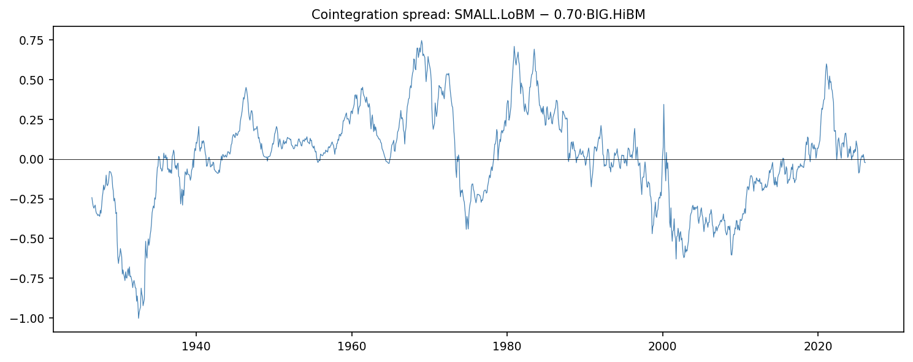

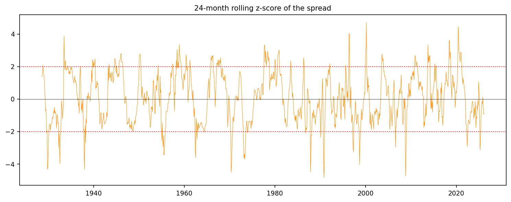

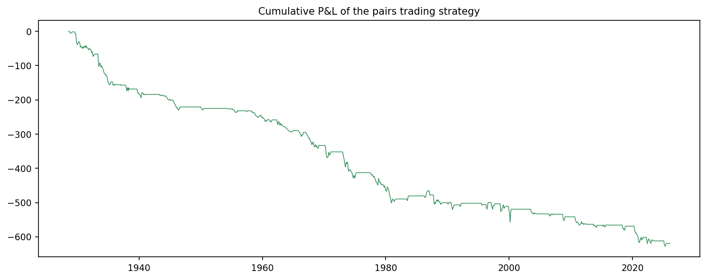

### 6. Mean-Variance Optimisation and Backtesting

The full-sample efficient frontier is computed analytically and plotted alongside the individual portfolio points, the tangency portfolio, and the global minimum variance (GMV) portfolio.

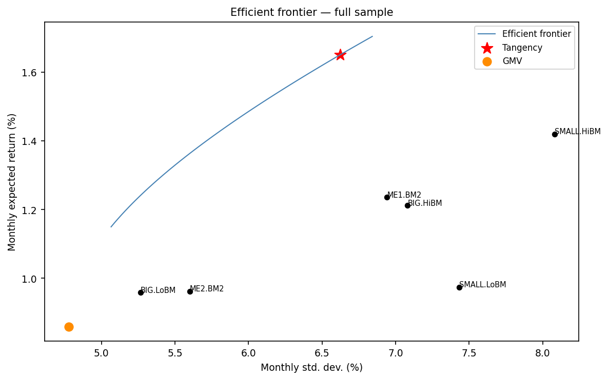

For the walk-forward backtest, a 60-month rolling estimation window is used and portfolio weights are updated monthly. Seven strategies are compared:

**Table 7: Out-of-sample backtest performance (1,135 months)**

| Strategy | Ann. Return | Ann. Volatility | Sharpe | Max Drawdown |
|---|---|---|---|---|
| Plug-in Tangency | 10.19% | 437.93% | 0.023 | −192.5% |
| Plug-in GMV | 11.98% | 15.74% | 0.761 | −76.7% |
| **Equally Weighted** | **14.11%** | **21.95%** | **0.643** | **−67.6%** |
| Risk Parity | 13.93% | 21.23% | 0.656 | −67.6% |
| Shrinkage Tangency | −48.95% | 664.11% | −0.074 | −13324% |
| **Long-only Tangency** | **15.34%** | **21.88%** | **0.701** | **−62.9%** |
| **Long-only + Shrinkage** | **15.21%** | **21.95%** | **0.693** | **−63.0%** |

The unconstrained plug-in tangency portfolio is the worst performer by a wide margin — its 437% annualised volatility and Sharpe of 0.023 reflect extreme, unstable weights driven by estimation error in sample means. The shrinkage tangency suffers the same problem: without a long-only constraint, shrinkage alone is not enough to stabilise leveraged positions. The plug-in GMV (which ignores expected returns and only minimises variance) achieves a respectable Sharpe of 0.76 by avoiding noisy mean estimates entirely.

Long-only constrained strategies are the clear winners. Long-only Tangency and Long-only + Shrinkage achieve Sharpe ratios above 0.69 and maximum drawdowns around −63%, while also delivering the highest annualised returns (15.2–15.3%). Equally weighted is a strong competitor throughout, delivering 14.1% return at 0.64 Sharpe with minimal complexity. This is the canonical result in the empirical asset allocation literature: in the presence of estimation error, naive diversification is hard to beat.

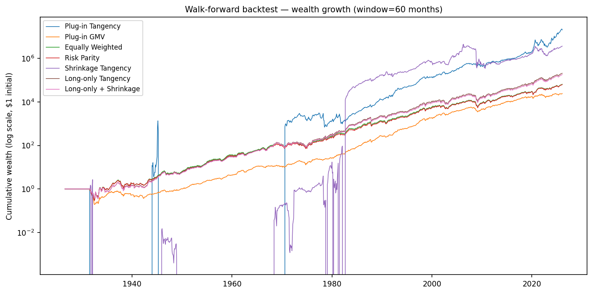

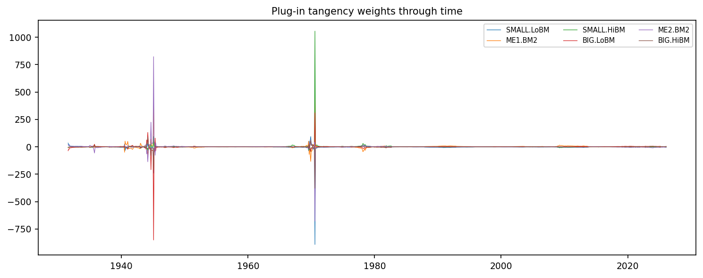

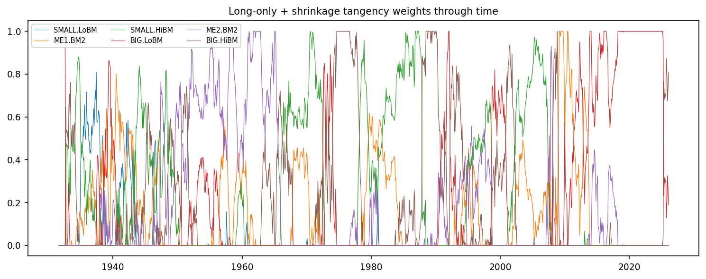

## Econometrics Library (econ_lib.py)

All routines are implemented from scratch:

- Standard normal CDF and chi-squared survival function (Abramowitz and Stegun approximations)
- Skewness, excess kurtosis, Jarque-Bera test
- ACF, PACF via Levinson-Durbin recursion
- Ljung-Box test, Engle ARCH-LM test
- ADF test with AIC-based lag selection and MacKinnon critical values
- Nelder-Mead simplex optimiser
- ARMA(p,q) via conditional sum-of-squares, ARIMA(p,d,q)
- GARCH(1,1) via maximum likelihood
- VAR(p) via OLS
- Engle-Granger cointegration test
- Markowitz efficient frontier, tangency and GMV portfolios
- Ledoit-Wolf shrinkage towards constant-correlation target
- Long-only tangency via projected gradient ascent on Sharpe ratio
- Walk-forward backtesting engine
- Performance summary (annualised return, volatility, Sharpe, max drawdown)

## Key Findings

- All six portfolios reject normality. Small-cap portfolios show higher kurtosis (up to 20.9 for SMALL.HiBM) and more pronounced skewness than large-cap ones. GARCH persistence (α + β) ranges from 0.969 to 0.980 across portfolios.
- Weak but detectable mean dynamics exist in some portfolios, with BIC selecting low-order models. Volatility clustering is not explained by the ARMA filter and requires GARCH treatment.
- Factor model R² values (0.86–0.97) confirm the three-factor model accounts for most cross-sectional variation. Size and value loadings are exactly as Fama-French theory predicts.
- Lagged factor signals do not beat the historical mean out-of-sample. All portfolios show negative OOS R² in the predictive regression, consistent with near-efficient monthly return dynamics.
- Only one of 15 portfolio pairs (SMALL.LoBM vs BIG.HiBM) passes the Engle-Granger cointegration test at 5%, and the pairs trade loses money over the full sample.
- Estimation error in plug-in mean-variance is severe. Long-only constraints are essential: Long-only Tangency achieves a Sharpe of 0.70 vs 0.02 for unconstrained plug-in tangency. Equally weighted (Sharpe 0.64) outperforms all unconstrained strategies.

## Dependencies

```bash
pip install numpy pandas matplotlib
```

No other packages are required.

## Usage

```bash
python run_analysis.py
```

Results are written to `figures/` (PDF and PNG) and `tables/` (JSON and CSV). Runtime is approximately 40 seconds on a standard laptop. The output directory can be overridden with the `FMA4200_OUT` environment variable. The data path can be overridden with `FMA4200_DATA`.
